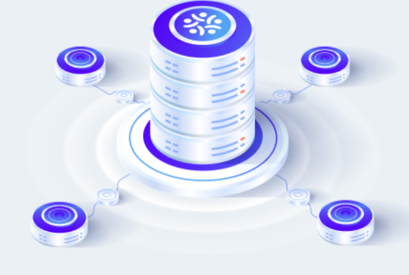

# Introduction

<!-- 

 -->

<figure markdown>

</figure>

In the fast-paced world of finance, staying ahead of the curve is really important. Algorithmic trading or algo trading, has revolutionized the way traders operate in the market, enabling them to execute complex strategies with speed and precision. However, for many aspiring traders, the barrier to entry into algorithmic trading has traditionally been high, often requiring advanced programming skills and intricate technical knowledge.

But we here at Pocketful believe that breaking into algorithmic trading doesn't necessarily demand a background in programming. At Pocketful, we're reshaping the landscape of algorithmic trading by providing seamless APIs that empower traders of all skill level to leverage the power of algorithms effortlessly.

## Prerequisites
 You don't need to be a coding wizard to excel – simply follow our lead, and we'll guide you every step of the way. Whether you're a seasoned trader looking to automate your strategies or a newcomer eager to explore the possibilities, our platform empowers you to dive into algo. trading with ease. 

 What you need is a computer system, a good internet connection and your interest for trading.

## Python SDK for Algorithmic Trading
We're thrilled to introduce Python SDK, designed to revolutionize the way traders interact with the markets and make algorithmic trading accessible to everyone.
We have added a layer of abstraction and wrapped the raw http APIs into python methods. You just need to call those methods and you will get the desired response.  Click on the below link and start with your first step to install the Pocketful python library. 

<!-- - [Link for python library](https://github.com/pocketful-tech/pacefinapi-python){:target="_blank"} -->

<a href="https://github.com/pocketful-tech/pacefinapi-python" target="_blank">Link for python library</a>

Note - If you do not have python installed on your machine, please download and install it from the  <a href="https://www.python.org/" target="_blank">official website.</a>

Once you have installed Pocketful python library, you can go ahead in the documentation and start your journey.

