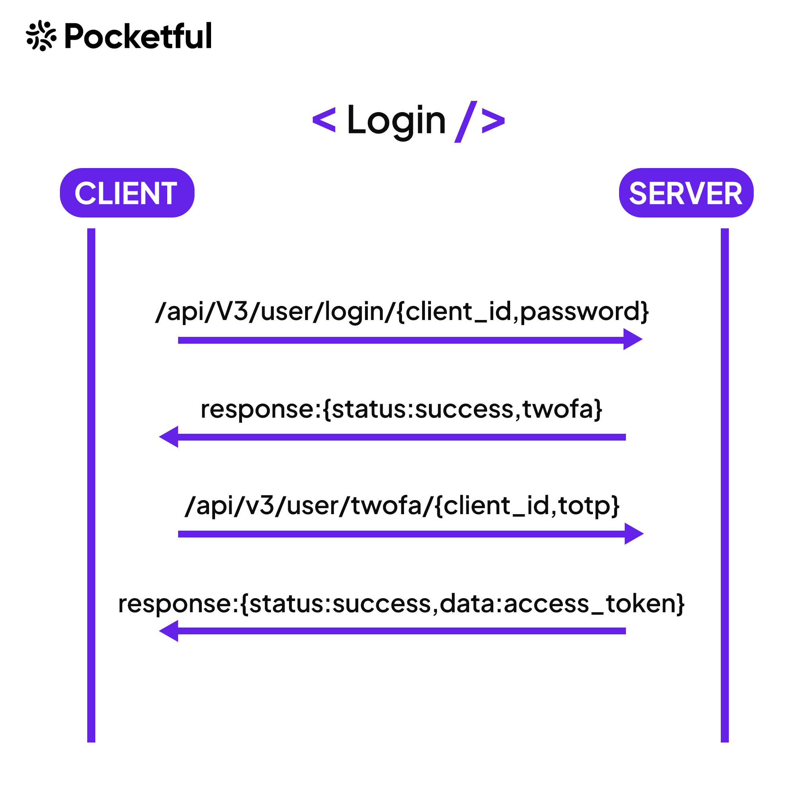

As a trader or investor, if you need to make a trade, the first step is obviously to login into your trading account; trading with API's is also the same, the first step is to login, not manually but with the API.

Pocketful boasts a robust and secure login mechanism fortified by two-factor authentication. Initially, user submits their credential, and the server validates them, responding with a success confirmation if the credentials are correct. Following this, the client is has to provide the TOTP for two-factor authentication. Upon successful verification of the TOTP, the server issues an access token, a crucial credential enabling seamless access to our APIs and retrieval of data.

<!--  -->


<figure markdown>
<p align="center"></p>
</figure>


 You can follow the below steps to login into your Pocketful account using API's.

If you don't have a Pocketful account till now,  you can register 
<a href="http://www.pocketful.in" target="_blank">here</a>


<!-- ## Login -->
To login into your Pocketful Account via API, you need a client Id, password and totp.


Follow the below example code snippet.

 import the Pocketful library

```python
from pocketful import pocketful
```

 Store your clientId and password into a variable

```python
pocket_client_id = "your-client-id"
pocket_password = "your-password"
```

 Create an instance of Pocketful class
```python
pocket = pocketful()
```

 Generate a session with your client-id, password and totp of your account with the help of instance you created above.
```python
login = pocket.generateSession(pace_clintId, pace_password,"totp")  
```


 After the login, we get an access token in response, use pocket instance to store the access token.
```python
setAccessToken = pocket.setAccessToken(login["data"]["auth_token"])
```

Congratulations! By following the steps outlined above, you have seamlessly accessed your Pocketful account without the need for any manual intervention, thanks to the assistance of our APIs and methods.


With full access to your Pocketful account now granted, you're empowered to leverage our methods for executing trades or querying your account details. Next you can consider our documentation as a comprehensive tutorial where you can proceed step-by-step, mastering at your own pace. Alternatively, feel free to navigate directly to the methods or APIs that pique your interest, allowing you to embark on your journey with freedom and flexibility.


