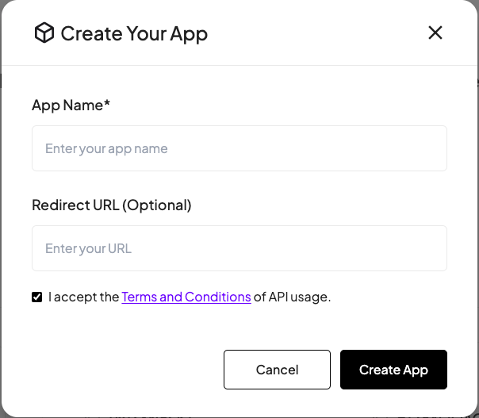
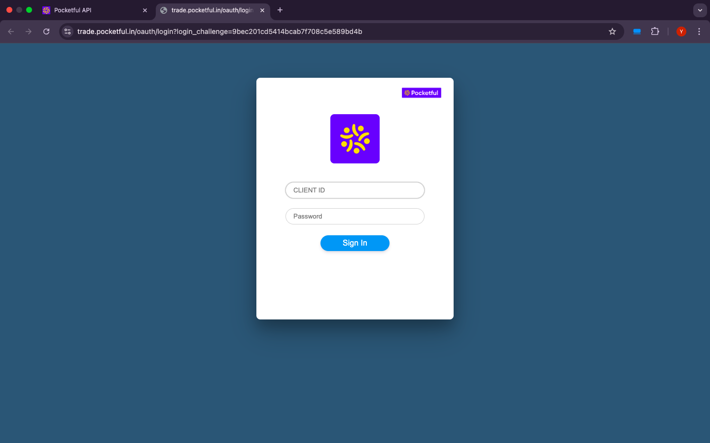
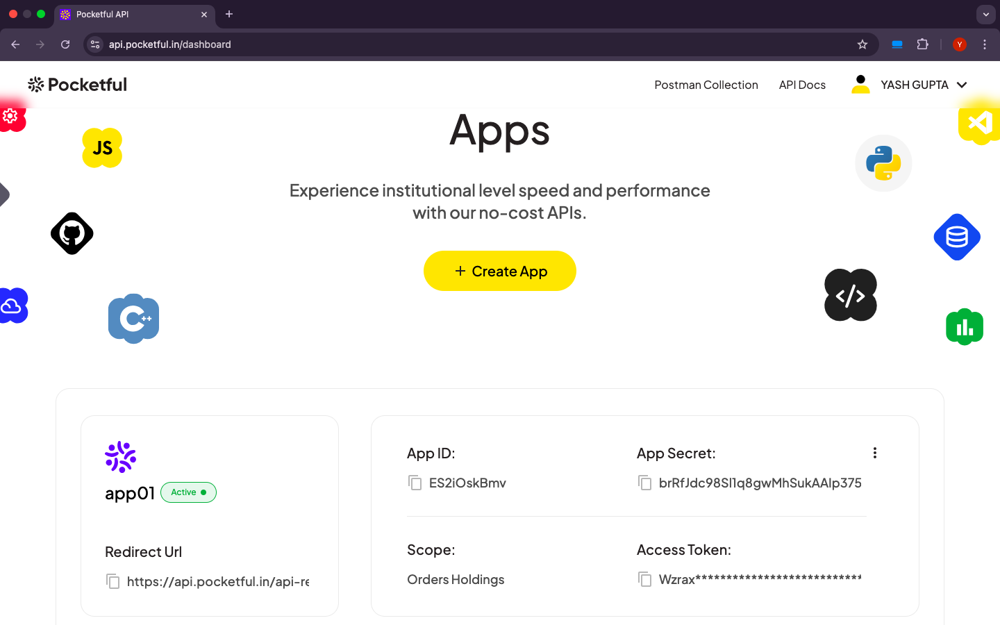

# **Login Process**

Pocketful offers a secure and efficient login process, simply follow the steps below to generate an access token and start interacting with the API's.

### Steps to Generate an Access Token:

To begin, visit the <a href="https://api.pocketful.in/login" target="_blank">Pocketful API Portal</a> and log in with your Pocketful account credentials. If you don't yet have an account, you can <a href="https://web.pocketful.in/kyc/" target="_blank">register here</a>. 

#### 1. **Create an App:**
- Click the **Create App** button on your dashboard.
- Fill in the **App Name** and **Redirect URL** in the provided form. If you prefer an easier setup, use the default redirect URL to skip managing the login process and API calls yourself.
- Click **Create App** button, and your app will be successfully created.

<figure markdown>

</figure>

#### 2. **Authenticate the App:**
- In your newly created app, click the **"Generate Access Token"** button.
- This will redirect you to the login page, where you'll need to enter your Pocketful account credentials for authentication.

<figure markdown>

</figure>

#### 3. **Access Token Generation:**
- After successful authentication, you will be redirected back to your app’s dashboard.
- On the dashboard, you’ll see your newly generated **Access Token**, which you can use to make secure API calls for trading and account-related operations.

<figure markdown>

</figure>

> **Note:** 

> - **Default Redirect URL**: If you use Pocketful's default redirect URL during app creation, you can generate access tokens directly using the **"Generate Access Token"** button.

> - **Custom Redirect URL**: If you use a custom redirect URL, you will need to handle authentication on your own server and utilize Pocketful’s OAuth 2.0 APIs to generate the access token. For detailed guidance on OAuth 2.0 APIs, refer to the <a href="Oauth-Login.html" target="_blank">OAuth API Page</a>.

> - **Access Token Validity**: The access token remains valid until the end of the day (i.e. 12:00AM), after which it will expire, and a new access token has to be generated.

### Base URL for API Calls

All API requests will be using the following base URL

Base URL: **https://trade.pocketful.in**

With your access token in hand, you now have full access to Pocketful API. Whether you're executing trades or querying your account details, you can refer to our detailed documentation for a step-by-step guide.
