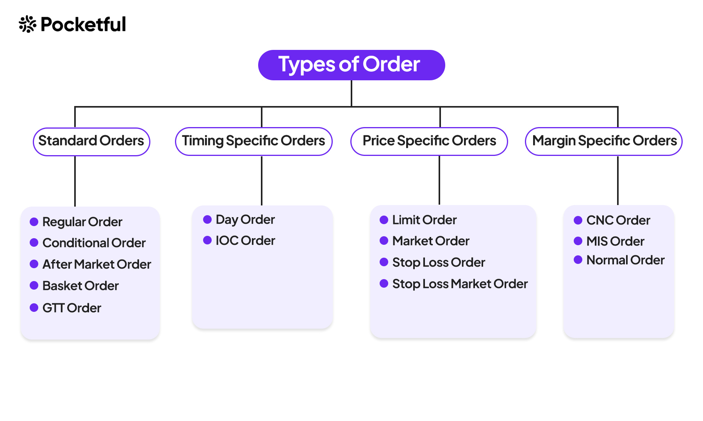

# Orders: A Comprehensive Guide

In the dynamic world of stock trading, understanding the intricacies of different order types is essential for investors to navigate the market with confidence and precision. Each order type serves a distinct purpose, offering flexibility and control over trading activities. Let's dive into the diverse array of order types and explore their unique characteristics and applications.

1.__Standard Orders__:

**Regular Order**: A cornerstone of trading, the regular order, also known as a day order, instructs brokers to execute trades at prevailing market prices within the current trading session. Ideal for investors seeking immediate execution without carrying orders forward to the next day.

**Conditional Order**: Conditional orders are triggered by predefined conditions, such as specific price levels or market events. These orders provide flexibility, allowing investors to automate trades based on predetermined criteria, enhancing efficiency and reducing manual intervention.

**After-Market Order**: For those unable to trade during regular market hours, after-market orders offer a solution. Placed outside standard trading sessions, these orders queue for execution when the market reopens, enabling investors to capitalize on opportunities beyond traditional trading hours.

**Basket Order**: Simplifying the management of multiple positions, basket orders combine various securities into a single order for simultaneous execution. This streamlined approach enhances efficiency, allowing investors to execute complex trading strategies with ease.

**Good Til Triggered (GTT) Order**: GTT orders empower investors to set trigger prices for buy or sell orders, remaining active until the specified conditions are met. Offering flexibility and control, GTT orders enable strategic trading based on predetermined triggers, optimizing trading outcomes.

2.Timing-Specific Orders:

**Day Order**: A standard in stock trading, day orders remain active until the end of the trading day, ensuring execution within the current session. This order type is ideal for investors seeking timely execution without carrying orders forward.

**Immediate or Cancel (IOC) Order**: IOC orders prioritize immediate execution, with any unfilled portion canceled instantly. This order type is suitable for investors who prioritize swift execution over price precision, particularly in fast-moving markets.

3.**Price-Specific Orders**:

**Limit Order**: Providing control over execution prices, limit orders specify the maximum price for buy orders or the minimum price for sell orders. This order type offers price precision, allowing investors to execute trades at predetermined levels, minimizing execution risks.

**Market Order**: Market orders prioritize immediate execution at prevailing market prices. While offering prompt execution, market orders may result in execution at slightly different prices from the prevailing market rates, particularly in volatile market conditions.

**Stop-Loss (SL) Order**: Designed to limit potential losses, stop-loss orders automatically trigger market orders once the stock price reaches a predetermined level. This order type protects investors from significant losses by executing trades at the best available prices.

**Stop-Loss Market (SLM) Order**: Similar to stop-loss orders, SLM orders trigger market orders once the specified stop price is reached. Offering immediate execution, SLM orders protect investors from adverse price movements by executing trades promptly at prevailing market prices.

4.**Margin-Specific Orders**:

**Cash and Carry (CNC) Order**: CNC orders are intended for delivery-based trading, requiring investors to have sufficient funds in their accounts to cover the full purchase price of securities. This order type is suitable for investors looking to hold securities for longer periods.

**Margin Intraday Square-off (MIS) Order**: MIS orders allow investors to leverage margin facilities provided by brokers for intraday trading. These orders must be squared off before the end of the trading session, making them ideal for short-term trading strategies.

**Normal (NRML) Order**: Normal is an order type primarily utilized for overnight or positional trading in the Indian stock market. When traders place an NRML order, they express their intent to buy or sell stocks, futures, or options with the intention of holding these positions overnight or for multiple days. Unlike Margin Intraday Square-off (MIS) orders, NRML orders do not entail an automatic square-off by the broker at the end of the trading day. Instead, positions initiated through NRML orders require the trader to manually square them off.

In conclusion, mastering the diverse range of stock market orders is crucial for investors to execute trades effectively and achieve their financial goals. By understanding the nuances of each order type and their applications, investors can optimize their trading strategies, minimize risks, and capitalize on market opportunities with confidence.

