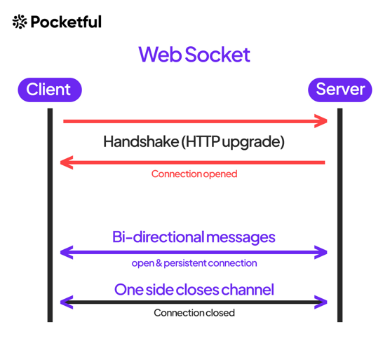

## Live Market Data

 Live market feeds play a vital role in the share market by facilitating informed decision-making, identifying opportunities, managing risks, enabling algorithmic trading, facilitating information flow, and providing a competitive edge to market participants. Access to real-time market data is essential for investors seeking to navigate the complexities of the stock market and achieve their investment objectives. Some detailed points which explains the importance of live market feed are

Timely Decision Making: In the fast-paced environment of the stock market, every second counts. Live market feeds provide real-time updates on stock prices, market trends, and news, allowing investors to make timely decisions. Whether buying, selling, or holding positions, having access to up-to-the-second information helps investors react swiftly to market changes.

Opportunity Identification: Live market feeds enable investors to identify opportunities quickly. By monitoring live price movements, volume, and order book data, investors can spot emerging trends, volatility, and trading opportunities. This information empowers investors to capitalize on favorable market conditions or adjust their strategies in response to changing market dynamics.

Risk Management: Real-time market data aids in risk management by providing insights into market sentiment and potential risks. Investors can monitor factors such as price fluctuations, trading volumes, and news events to assess and mitigate risks associated with their investments. Additionally, live market feeds facilitate the implementation of stop-loss orders and other risk management strategies to protect investment portfolios.

Algorithmic Trading: Live market data is essential for algorithmic trading strategies, where automated systems execute trades based on predefined rules and market conditions. These algorithms rely on real-time data to analyze market trends, execute trades, and manage positions efficiently. High-frequency trading, arbitrage, and other algorithmic strategies heavily depend on live market feeds to achieve optimal performance.

Information Flow: Live market feeds serve as a conduit for disseminating critical information to market participants. From corporate announcements and economic indicators to geopolitical events and regulatory changes, real-time market data provides investors with the latest information that may impact stock prices and overall market sentiment. Access to timely information fosters transparency and enhances market efficiency.

Competitive Edge: In today's highly competitive financial markets, having access to live market feeds can provide a competitive edge. Traders and investors who can react swiftly to market developments and make informed decisions based on real-time data are better positioned to capitalize on opportunities and navigate market fluctuations successfully.

In summary, live market feeds play a vital role in the share market by facilitating informed decision-making, identifying opportunities, managing risks, enabling algorithmic trading, facilitating information flow, and providing a competitive edge to market participants. Access to real-time market data is essential for investors seeking to navigate the complexities of the stock market and achieve their investment objectives.

## Websockets

Websockets are a communication protocol that provides full-duplex communication channels over a single, long-lived TCP connection. This protocol enables real-time data transfer between a client and a server, allowing them to exchange messages in both directions simultaneously. Unlike traditional HTTP connections, which follow a request-response model and require separate connections for each request, Websockets establish a persistent connection that remains open as long as needed.

In contrast to HTTP, where a client initiates communication by sending a request to a server and waits for a response, Websockets allow for bidirectional communication. This means that once the connection is established, either the client or the server can initiate the exchange of data at any time without waiting for a request. This capability is particularly useful for applications that require real-time updates or interactive communication, such as chat applications, online gaming, financial trading platforms, and live data streaming services.

The process of establishing a connection in Websockets involves a handshake mechanism. Initially, the client sends an HTTP request to the server, indicating its intent to upgrade the connection to a WebSocket connection. If the server supports Websockets, it responds with an HTTP 101 status code (Switching Protocols) along with the necessary headers to indicate the protocol upgrade. Subsequently, the connection transitions from the HTTP protocol to the WebSocket protocol, and both the client and server can start exchanging messages in a full-duplex manner. This handshake process typically occurs during the initial connection establishment and allows for seamless transition to the WebSocket protocol, enabling efficient real-time communication between the client and server.